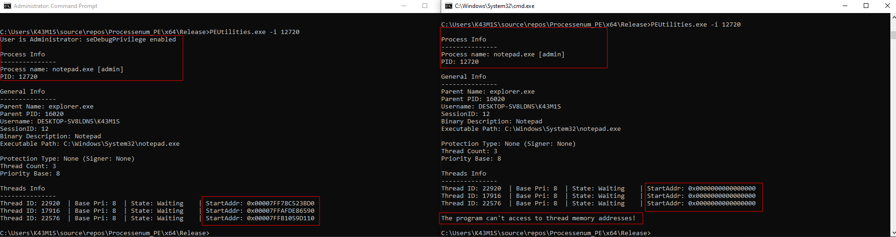
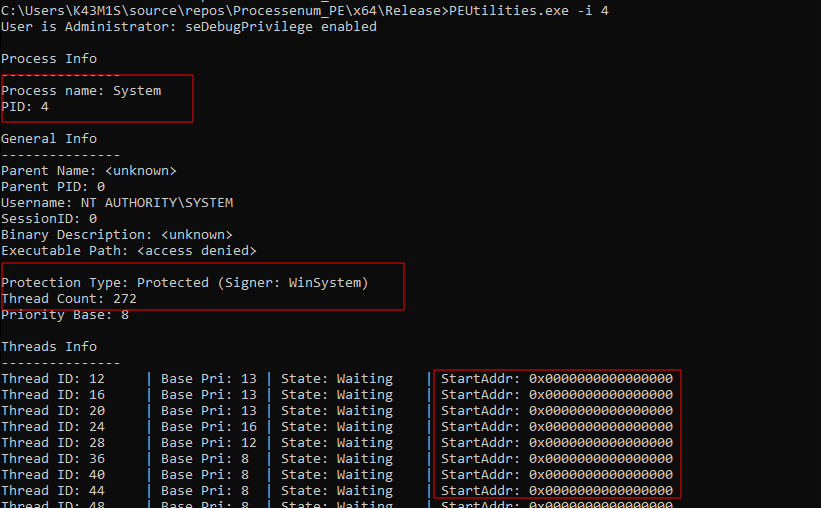
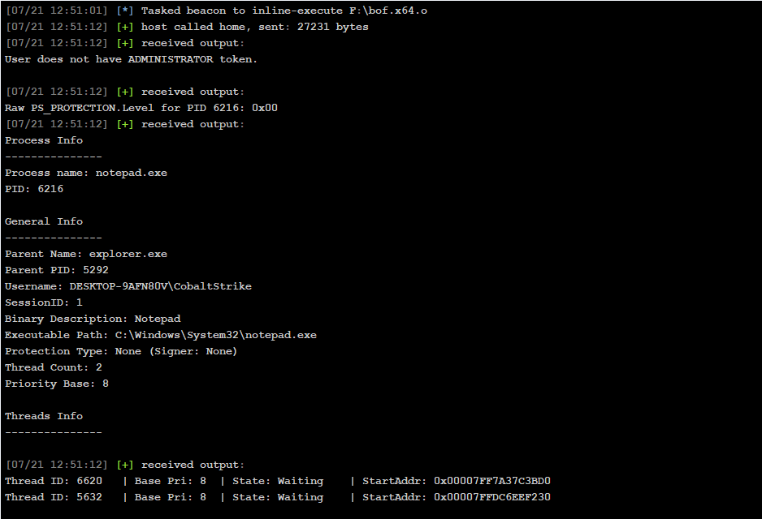
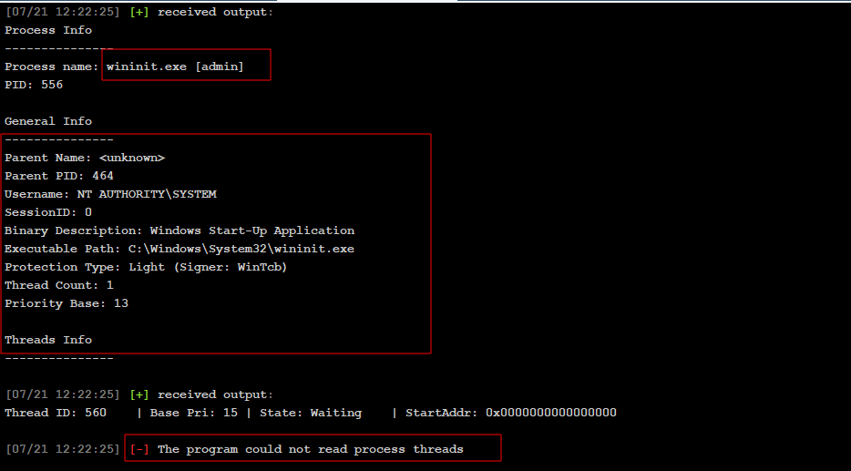

# Process and Service Enumeration Tool Research

The main objective of this research is to **create a tool to enumerate processes and services in a Windows system**, similar to a console version of the System Informer application. To do so, I created two approaches:

1. Portable Executable program (.exe)  
2. Beacon Object File (.o)

At a high level, the program retrieves the following information for the user:

- Running **processes** and **services**
- Associated **user and session information**
- Detailed **thread-level information**
- **Process protection status** (e.g., protected process, signer info)
- **Executable description, path**, and **parent process**
- **Service-to-process mapping**

The program is not suitable for restricted environments such as AppContainer or WinPE.

# 1 - Portable Executable Program

#### Implementation

First, the program parses the user input, initializes the service array, and enables `SeDebugPrivilege` if the user is an administrator.

Then, it processes the input arguments and calls the corresponding functionality, such as retrieving process information, monitoring threads, or listing services.

Finally, it performs cleanup of the allocated memory.

```c
showProcesses() lists the following information for all processes:
	- PID
	- Executable name
	- Associated user
	- Session ID
	- Service name (if applicable)

findProcess() searches for a process given its processName and retrieves:
	- PID
	- Whether the process is running elevated (admin)

getProcessInfo() prints:
	- Process name and PID
	- Parent PID and name
	- User and session information
	- Description from executable metadata
	- Executable path
	- Protected process information (ZwQueryInformationProcess)
	- Thread count and base priority
	- Calls threadInfo()

watchProcessThreads():
	- Repeats `threadInfo()` every second for a given number of iterations

threadInfo() (SystemProcessInformation) displays:
    - Thread state information
    - Matches this information with the Toolhelp32 thread snapshot
    - Helps correlate thread-level behavior of the process
```

#### Considerations

1. The program uses **undocumented NT APIs** resolved dynamically:
	- `NtQuerySystemInformation`
	- `ZwQueryInformationProcess`
	- `NtQueryInformationThread`

2. When attempting to open a process, there are two approaches. This is useful for accessing protected PIDs:
	1. `PROCESS_QUERY_LIMITED_INFORMATION | PROCESS_VM_READ`
	2. If it fails, `PROCESS_QUERY_LIMITED_INFORMATION`

```c
DWORD ACCESS_TYPE = PROCESS_QUERY_LIMITED_INFORMATION | PROCESS_VM_READ;
HANDLE hProcess = OpenProcess(ACCESS_TYPE, FALSE, pid);

if (!hProcess) {
	hProcess = OpenProcess(PROCESS_QUERY_LIMITED_INFORMATION, FALSE, pid); // Retry
}

if (!hProcess) {
	DWORD err = GetLastError();

	if (err == ERROR_ACCESS_DENIED) {
		printf("Access denied opening process %lu. It may be a protected system process.\n", pid);
	}
	else {
		printf("Unable to open process %lu (Error: %lu)\n", pid, err);
	}

	CloseHandle(hSnapshot);
	return;
}
```

3. Sometimes thread information cannot be accessed by the user. In this case, the program retrieves partial information:



4. The program cannot retrieve information from protected NT SYSTEM processes:



# 2 - Beacon Object File

In this version, several modifications were made compared to the PE version. Some functions were simplified, and data is returned using buffers to provide a better experience for Red Team operators.

The program defines the following NT Windows API definitions:

```c
typedef NTSTATUS(NTAPI* PNtQuerySystemInformation)(
    ULONG SystemInformationClass,
    PVOID SystemInformation,
    ULONG SystemInformationLength,
    PULONG ReturnLength
    );

typedef NTSTATUS(NTAPI* PNtQueryInformationThread)(
    HANDLE ThreadHandle,
    ULONG ThreadInformationClass,
    PVOID ThreadInformation,
    ULONG ThreadInformationLength,
    PULONG ReturnLength
    );
```

DFRs:

```c
// Function pointers for KERNEL32
DECLSPEC_IMPORT DWORD WINAPI KERNEL32$GetLastError(VOID);
DECLSPEC_IMPORT BOOL WINAPI KERNEL32$FreeLibrary(HMODULE);
DECLSPEC_IMPORT HMODULE WINAPI KERNEL32$LoadLibraryA(LPCSTR);
DECLSPEC_IMPORT BOOL WINAPI KERNEL32$CloseHandle(HANDLE);
DECLSPEC_IMPORT HANDLE WINAPI KERNEL32$GetCurrentProcess(VOID);
DECLSPEC_IMPORT HANDLE WINAPI KERNEL32$OpenProcess(DWORD, BOOL, DWORD);
DECLSPEC_IMPORT BOOL WINAPI KERNEL32$ProcessIdToSessionId(DWORD, DWORD*);
DECLSPEC_IMPORT HANDLE WINAPI KERNEL32$CreateToolhelp32Snapshot(DWORD, DWORD);
DECLSPEC_IMPORT int WINAPI KERNEL32$MultiByteToWideChar(UINT, DWORD, LPCCH, int, LPWSTR, int);
DECLSPEC_IMPORT BOOL WINAPI KERNEL32$Process32FirstW(HANDLE, PROCESSENTRY32W*);
DECLSPEC_IMPORT BOOL WINAPI KERNEL32$Process32NextW(HANDLE, PROCESSENTRY32W*);
DECLSPEC_IMPORT int WINAPI KERNEL32$WideCharToMultiByte(UINT, DWORD, LPCWCH, int, LPSTR, int, LPCCH, LPBOOL);
DECLSPEC_IMPORT BOOL KERNEL32$Thread32First(HANDLE, LPTHREADENTRY32W);
DECLSPEC_IMPORT BOOL KERNEL32$Thread32Next(HANDLE, LPTHREADENTRY32W);
WINBASEAPI BOOL WINAPI KERNEL32$QueryFullProcessImageNameA(HANDLE hProcess, DWORD dwFlags, LPSTR lpExeName, PDWORD lpdwSize);
WINBASEAPI VOID WINAPI KERNEL32$GetSystemTime(LPSYSTEMTIME lpSystemTime);
WINBASEAPI VOID WINAPI KERNEL32$Sleep(DWORD dwMilliseconds);
WINBASEAPI FARPROC WINAPI KERNEL32$GetProcAddress(HMODULE hModule, LPCSTR lpProcName);
WINBASEAPI HMODULE WINAPI KERNEL32$GetModuleHandleA(LPCSTR lpModuleName);
WINBASEAPI HANDLE WINAPI KERNEL32$OpenThread(DWORD, BOOL, DWORD);

// Function pointers for MSVCRT
DECLSPEC_IMPORT void* __cdecl MSVCRT$memcpy(void*, const void*, size_t);
DECLSPEC_IMPORT void* __cdecl MSVCRT$calloc(size_t, size_t);
DECLSPEC_IMPORT void* __cdecl MSVCRT$malloc(size_t);
DECLSPEC_IMPORT void __cdecl MSVCRT$free(void*);
DECLSPEC_IMPORT int __cdecl MSVCRT$_wcsicmp(const wchar_t*, const wchar_t*);
DECLSPEC_IMPORT int __cdecl MSVCRT$atoi(const char* str);

// Function pointers for ADVAPI32
DECLSPEC_IMPORT SC_HANDLE WINAPI ADVAPI32$OpenSCManagerA(LPCSTR, LPCSTR, DWORD);
DECLSPEC_IMPORT BOOL WINAPI ADVAPI32$EnumServicesStatusExA(SC_HANDLE, SC_ENUM_TYPE, DWORD, DWORD, LPBYTE, DWORD, LPDWORD, LPDWORD, LPDWORD, LPCSTR);
DECLSPEC_IMPORT BOOL WINAPI ADVAPI32$OpenProcessToken(HANDLE, DWORD, PHANDLE);
DECLSPEC_IMPORT BOOL WINAPI ADVAPI32$LookupPrivilegeValueA(LPCSTR, LPCSTR, PLUID);
DECLSPEC_IMPORT BOOL WINAPI ADVAPI32$AdjustTokenPrivileges(HANDLE, BOOL, PTOKEN_PRIVILEGES, DWORD, PTOKEN_PRIVILEGES, PDWORD);
DECLSPEC_IMPORT BOOL WINAPI ADVAPI32$LookupAccountSidA(LPCSTR, PSID, LPSTR, LPDWORD, LPSTR, LPDWORD, PSID_NAME_USE);
DECLSPEC_IMPORT BOOL WINAPI ADVAPI32$GetTokenInformation(HANDLE, TOKEN_INFORMATION_CLASS, LPVOID, DWORD, PDWORD);
```

Proof of Concept:



As mentioned previously, a process without administrator permissions cannot access threads from NT SYSTEM processes. This limitation also applies to Windows protected processes:


